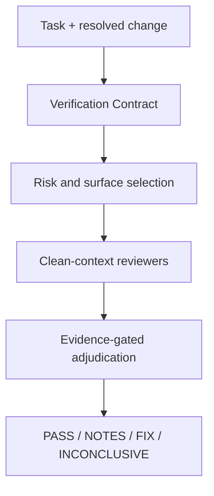

# Architecture

## Decision

Build one canonical Agent Skill at `.agents/skills/verify`. Keep the orchestration policy in `SKILL.md`, detailed contracts in shared references, and each reviewer mandate in its own role file.

The verification lead uses the host's native subagent capability. There is no custom runtime.

## Why a single orchestrator skill

- Specialist roles are implementation details, not capabilities users need to discover independently.
- Separate role files preserve progressive disclosure and let clean-context reviewers load only their mandate.
- Permanent host-specific agent definitions would duplicate policy and drift.
- The same skill is discoverable by Codex, OpenCode, Cursor, and Antigravity from `.agents/skills`, following the Agent Skills standard.

## Execution boundaries

- Maximum delegation depth: one.
- Normal automatic panel: two to five reviewers.
- Reviewers are read-only and cannot fix or delegate.
- The verification lead adjudicates; reviewer output never directly determines the verdict.
- Existing project tools may be executed. New verification dependencies are not installed by the skill.
- Actual mutation testing runs only when already configured and only in an isolated copy/worktree. Otherwise use semantic sabotage analysis.

## Host behavior

| Host | Canonical skill | Invocation | Adapter |
|---|---|---|---|
| Cursor | `.agents/skills/verify` or installed GitHub skill | `/verify` | None |
| ChatGPT Work | plugin-bundled skill | `@verify` | Future plugin packaging |
| Codex CLI/IDE | `.agents/skills/verify` | `$verify` | None |
| OpenCode | `.agents/skills/verify` | `/verify` | `.opencode/commands/verify.md` |
| Antigravity (`agy`) | `.agents/skills/verify` | `/verify` (interactive TUI) / contextual (CLI `-p`) | None |

Host-specific files may invoke or expose the canonical skill, but must not duplicate its verification policy.

## Assurance degradation

If the host lacks subagents, the lead may run roles sequentially, but must label the report `degraded independence`. Essential unavailable evidence or materially ambiguous intent produces `INCONCLUSIVE`, not `PASS`.

## Evaluation architecture

`scripts/eval_harness.py` materializes each case as a real Git repository with a baseline commit and candidate working-tree diff. The candidate's own tests normally pass. A verifier report is scored against semantic expectations—verdict, selected roles, contract linkage, evidence paths, defect concepts, evidence gaps, and source immutability—rather than exact prose.

## Assurance boundaries and incremental re-verification (v0.3)

v0.3 introduces assurance boundaries to verify entire systems, features, workflows, or artifacts rather than only git commits or diffs:
- **Target identity**: `feature`, `subsystem`, `workflow`, and `artifact` targets define their boundary via `target.identity` (`in_scope`, `out_of_scope`, `anchor`, and `acceptance_criteria`).
- **State persistence**: Prior verification states are recorded in `<cwd>/.verify/state.json` (or `$VERIFY_STATE_PATH`). Storage is target-local and host-wrapped; the verify skill remains strictly read-only.
- **Delta invalidation**: When re-verifying against prior state, the delta is evaluated against the invalidation map to re-run only invalidated reviewers while reusing untainted findings.
- **Scope-preservation guard**: Adjudication enforces that reviewers evaluate against the user's full target boundary; claims that narrow scope below the target are rejected as `out-of-target-narrowing`.

## Deferred decisions

- Plugin packaging and marketplace distribution.
- Optional host-specific permission profiles for stronger read-only enforcement.
