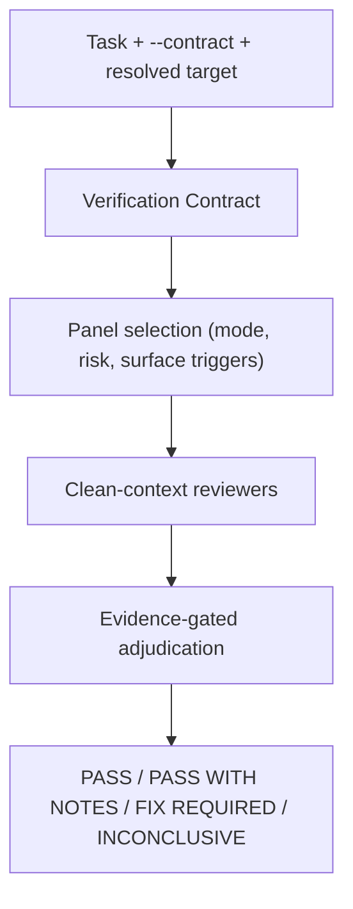

# Architecture

## Decision

Build one canonical Agent Skill at `.agents/skills/verify`. Keep the orchestration policy in `SKILL.md`, detailed contracts in shared references, and each reviewer mandate in its own role file. There is no custom runtime; the verification lead uses the host's native subagent capability.

```mermaid
flowchart TD
    A["Task + --contract + resolved target"] --> B["Verification Contract"]
    B --> C["Panel selection (mode, risk, surface triggers)"]
    C --> D["Clean-context reviewers"]
    D --> E["Evidence-gated adjudication"]
    E --> F["PASS / PASS WITH NOTES / FIX REQUIRED / INCONCLUSIVE"]
```

## Modes

`quick` (one reviewer context carrying both the acceptance and tests roles; max roles 2), `panel` (default; baseline: acceptance + tests; max roles 4), `release` (baseline: acceptance + tests + regression; max roles 5). Surface triggers and risk bands select any additional roles up to the mode's maximum; see [`references/panel.md`](../.agents/skills/verify/references/panel.md).

## Reviewer roles

Exactly five: `acceptance`, `tests`, `regression`, `invariants`, `security`. Each role runs as one reviewer; a role is never split across reviewers.

## The `--contract` file

An optional human-editable file (for example a work-item or issue export) holding the task statement, acceptance criteria, and non-goals. When supplied it outranks every other intent source and its acceptance-criterion ids are preserved verbatim into the report.

## Execution boundaries

- Maximum delegation depth: one. Reviewers never delegate or fix.
- The verification lead adjudicates; reviewer output never directly determines the verdict.
- Existing project tools may be executed; the skill installs no new dependencies.
- The skill is read-only with respect to source, tests, configuration, and the `--contract` file.

## Host behavior

The same skill is discoverable by every compliant host from `.agents/skills` (or a host-specific symlink); see [Installation](installation.md) for the discovery table. Host-specific files may invoke or expose the canonical skill but must not duplicate its verification policy.

## Assurance degradation

If the host lacks subagents, the lead may run roles sequentially, but must label the report `degraded independence`. Essential unavailable evidence or materially ambiguous intent produces `INCONCLUSIVE`, not `PASS`.

## Evaluation architecture

`scripts/eval_harness.py` materializes each fixture as a real Git repository with a baseline commit and a candidate working-tree diff. `check` independently re-materializes the same base+candidate snapshots into a scratch directory and compares content digests, rather than trusting anything recorded inside the checked repository. A verifier report is then scored against semantic expectations — verdict, selected roles, evidence paths, defect concepts, and evidence gaps — rather than exact prose.
